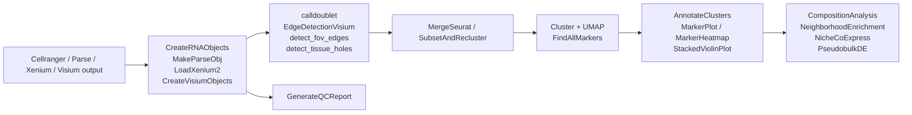

<h1 align="center">SingleCellTools</h1>

<p align="center">
  <strong>Opinionated R wrappers for end-to-end single-cell analysis</strong><br/>
  Load it, filter it, doublet-call it, merge it, integrate it, plot it &mdash; in fewer lines.
</p>

<p align="center">
  <a href="https://github.com/gevensen95/SingleCellTools/releases">
    
  </a>
  <a href="https://github.com/gevensen95/SingleCellTools/commits/main">
    
  </a>
  = 2.10" />
  
  
</p>

---

## Overview

`SingleCellTools` is a collection of wrapper functions that reduce the boilerplate of common
single-cell workflows in R. Most of the package is built around **loading**, **filtering**, and
**integrating** single-cell data so you can spend more time on the analysis and less on the
plumbing.

Key things it does:

- Reads counts from **10x Genomics**, **Parse Biosciences**, **Visium**, **Xenium**, and **scATAC-seq** outputs into Seurat objects
- Calls **doublets** with DoubletFinder using either `LogNormalize` or `SCTransform`
- **Merges** and **integrates** lists of Seurat objects (Harmony / RPCA / CCA / JointPCA) with sensible defaults, and can subset + re-cluster a result for cell-type-specific re-analysis
- Detects **edge spots** in Visium capture areas, generic spatial **FOV edges**, and **internal tissue holes** &mdash; spots/cells that often have abnormal counts and should be filtered
- Two functions can be run **interactively** so you can pick filtering cutoffs by eye
- Generates a self-contained **HTML QC report** (per-sample summaries, suggested cutoffs, spatial QC maps)
- **Annotates clusters** with cell-type labels (marker scoring via UCell, or SingleR reference mapping) and assigns cells to **anatomical regions** from hand-drawn polygons
- Computes **cell-type composition** per sample/condition (with optional chi-square / Fisher tests) and plots it
- Spatial **neighborhood enrichment** between cell types, unsupervised **niche** assignment, and niche-resolved **differential gene co-expression**
- **Pseudobulk differential expression** (DESeq2) across donors/replicates
- Round-trips Seurat objects to/from **AnnData** (`.h5ad`) via `zellkonverter`
- A growing set of utilities for cell-cycle scoring, niche analysis, spatial polygons, and annotated dot plots

> For general-purpose pairwise gene co-expression analysis (not tied to spatial niches), see
> [katlande/scCoExpress](https://github.com/katlande/scCoExpress) &mdash; this package's
> `NicheCoExpress()` is adapted in spirit from it, but is specifically for testing niche-level,
> per-sample co-expression differences between two conditions.

---

## Installation

```r
# install.packages("remotes")
remotes::install_github("gevensen95/SingleCellTools")
```

DoubletFinder is GitHub-only, so install that first if you don't have it:

```r
remotes::install_github("chris-mcginnis-ucsf/DoubletFinder")
```

Bioconductor dependencies (`EnsDb.Mmusculus.v79`, `glmGamPoi`, `GO.db`, `UCell`, `Signac`) need
Bioconductor configured. If install fails:

```r
if (!requireNamespace("BiocManager", quietly = TRUE)) install.packages("BiocManager")
BiocManager::install(c("EnsDb.Mmusculus.v79", "glmGamPoi", "GO.db", "UCell", "Signac"))
```

Some functions (see [Dependencies](#dependencies)) call optional packages listed under
`Suggests` &mdash; install these only if you need that specific function:

```r
BiocManager::install(c("DESeq2", "SingleR", "SummarizedExperiment", "zellkonverter"))
install.packages(c("sf", "rmarkdown", "knitr"))
```

---

## A 60-second tour

```r
library(SingleCellTools)

# 1. Read several Cellranger outputs into a list of Seurat objects,
#    compute percent.mt, tag with treatment, and call doublets.
samples <- list.dirs("data/cellranger", recursive = FALSE)
objs    <- CreateRNAObjects(
  data_dirs    = samples,
  treatment    = c("Vehicle", "Vehicle", "DrugA", "DrugA"),
  mt_pattern   = "^mt-",
  run_doublet_finder = TRUE,        # uses calldoublet() under the hood
  filter_doublets    = TRUE
)

# 2. Merge + integrate (Harmony by default), cluster, UMAP, and save markers.
merged <- MergeSeurat(
  seurat_objects     = objs,
  integration        = "HarmonyIntegration",
  cluster_resolution = 0.3,
  markers            = TRUE
)

# 3. Annotate cells with a curated marker panel.
markers <- data.frame(
  Gene    = c("Sftpc", "Sftpb", "Ager", "Hopx",  "Trp63", "Krt5"),
  Details = c("AT2",   "AT2",   "AT1",  "AT1",   "Basal", "Basal")
)
MarkerPlot(merged, markers)
```

---

## Function reference

<details open>
<summary><strong>Object creation / loading</strong></summary>

| Function | What it does |
|---|---|
| `CreateRNAObjects()` | Read 10x outputs (matrix folder or `.h5`) into a list of Seurat objects, compute `percent.mt`, optionally tag treatments and call doublets. |
| `CreateRNAObjectsFilter()` | Same as above but with **interactive** QC cutoff selection. |
| `CreateAndIntegrateRNA()` | One-shot pipeline: read &rarr; QC &rarr; merge &rarr; integrate &rarr; cluster &rarr; UMAP. |
| `MakeParseObj()` | Build Seurat objects from Parse Biosciences pipeline output (`DGE_filtered/`). |
| `CreateVisiumObjects()` | Load multiple Visium samples into a list. |
| `LoadXenium2()` | Streamlined Xenium loader. |
| `CreateATACObjects()` / `CreateATACObjectsFilter()` | scATAC-seq object construction (latter with interactive cutoff selection). |

</details>

<details open>
<summary><strong>QC, doublets, and gene-ID sanity checks</strong></summary>

| Function | What it does |
|---|---|
| `calldoublet()` | DoubletFinder wrapper. Pick `LogNormalize` or `SCT`, regress covariates, returns object tagged with `doublet_finder`. Strips intermediate layers/reductions on return. |
| `EdgeDetectionVisium()` | Flags Visium spots at the edge of the capture area, around tissue boundaries, and at tears &mdash; the spots with weird counts that you almost certainly want to drop. |
| `detect_fov_edges()` | Flags cells near the outer boundary of any spatial FOV (Visium, Xenium, MERFISH, ...) using an angular-gap + local-density test, with iterative ring labeling. |
| `detect_tissue_holes()` | Flags cells bordering internal gaps/holes within a spatial FOV via a 2D occupancy grid and flood fill &mdash; complements `detect_fov_edges()`. |
| `GenerateQCReport()` | Renders a self-contained HTML QC report: per-sample overview, violin/density plots, QC scatters, top expressed genes, suggested filtering cutoffs, cell-cycle/doublet breakdowns, sample-correlation heatmap, and (for spatial input) per-FOV QC maps including edge and tissue-hole sections. |
| `DetectGenes()` | Bulk detection / quality flags on a feature set. |
| `detect_gene_id_type()` | Inspects rownames to tell you if your features are HGNC/MGI symbols, Ensembl IDs, RefSeq, or Entrez. |
| `check_gene_ids_across_objects()` | Same check across a list &mdash; catches the silent "one object is symbols, another is Ensembl" trap before a merge. |
| `check_duplicate_genes()` | Reports duplicated feature names per object/assay &mdash; catches the most common cause of the `"duplicate 'row.names' are not allowed"` error during `merge()`. |

</details>

<details open>
<summary><strong>Merging and integration</strong></summary>

| Function | What it does |
|---|---|
| `MergeSeurat()` | Merge a list, normalize (SCT or LogNormalize), PCA, integrate (`HarmonyIntegration`/`RPCA`/`CCA`/`JointPCA`), cluster, UMAP, and (optionally) run `FindAllMarkers`. Supports spatial assays (`Visium`, `Xenium`). |
| `subset_opt()` | Subset variant that keeps spatial FOVs / images in sync with the cell list &mdash; avoids stale-image errors after subsetting. |
| `SubsetAndRecluster()` | Subset cells by identity, metadata column/value, or an explicit cell list, drop empty cells/genes left behind, then re-run PCA &rarr; integrate (optional) &rarr; UMAP &rarr; clustering on the subset. Useful for cell-type-specific re-analysis. |
| `combine_metadata()` | Stack `@meta.data` from a list of Seurat objects into one long tibble, tagging each row with its source sample and original cell barcode. |
| `CleanMolSlot()` | For spatial objects, drop molecules not assigned to any FOV from the molecules slot, shrinking the object. |
| `strip_workflow_artifacts()` | Remove normalized/scaled layers, variable-feature sets, and dimensional reductions (`pca`, `umap`, `harmony`, ...), leaving just counts + metadata &mdash; handy before saving or sharing an object. |

</details>

<details open>
<summary><strong>Annotation and scoring</strong></summary>

| Function | What it does |
|---|---|
| `AddGenePositivity()` | For a vector of genes, adds a logical `<gene>_pos` metadata column per cell. Accepts a single object or a list. |
| `assign_cell_cycle_phase()` | Cell-cycle phase assignment via UCell &mdash; like `CellCycleScoring` but with `AddModuleScore_UCell` under the hood. |
| `AnnotateClusters()` | Assign per-cluster cell-type labels: either average UCell marker-set scores per cluster ("marker" mode) or run SingleR against a reference and take a per-cluster majority vote ("singler" mode), with optional score/margin thresholds for an "Unknown" label. |
| `CompositionAnalysis()` | Cell counts and within-sample proportions per group (cluster/cell type) and sample, with an optional chi-square or Fisher's exact test comparing distributions across conditions. |
| `get_all_children()` | Recursively walk a GO term to collect every descendant. |

</details>

<details open>
<summary><strong>Spatial / niche</strong></summary>

| Function | What it does |
|---|---|
| `BuildMultipleNicheAssays()` | Construct a spatial neighborhood ("niche") assay across a list of objects, then cluster with `ClusterR::MiniBatchKmeans`. |
| `SetImageBoundary()` | Set / standardize image boundaries on spatial objects. |
| `combine_fovs()` | Merge multiple FOVs from the same sample. |
| `get_all_coords()` | Pull tissue coordinates across images. |
| `get_cells_in_polygon()` | Point-in-polygon test using `sf` &mdash; which cells fall inside a hand-drawn region? |
| `parse_polygons()` | Parse polygon definitions for use with the above. |
| `AnnotateRegions()` | Label every cell with the name of the polygon it falls inside (or `"unassigned"`), given a named list of `x`/`y` polygon data frames &mdash; pairs with `get_cells_in_polygon()` / `parse_polygons()`. |
| `NeighborhoodEnrichment()` | Permutation-based cell-type neighborhood enrichment (z-scores, empirical p-values, BH q-values) within and pooled across FOVs; optionally clusters each cell's neighborhood composition into spatial "niches" and writes the niche labels back onto the input object. |
| `NicheCoExpress()` | Per-sample, per-niche gene-pair co-expression (Manders Overlap Coefficient vs. an abundance-matched background), with differential testing between two conditions and optional cell-type-composition controls. |
| `plotNicheCoExpress()` | Heatmap of differential co-expression (`delta_log2`, with significance stars) or per-sample score plots for `NicheCoExpress()` results. |

</details>

<details open>
<summary><strong>Differential expression</strong></summary>

| Function | What it does |
|---|---|
| `PseudobulkDE()` | Aggregates single-cell counts per (sample, group) and runs DESeq2 to test a contrast between two conditions &mdash; the statistically correct alternative to per-cell Wilcoxon DE when there are multiple cells per donor. Returns DE results plus size-factor-normalized pseudobulk counts. |

</details>

<details open>
<summary><strong>Data interop (AnnData)</strong></summary>

| Function | What it does |
|---|---|
| `FromAnnData()` | Read an `.h5ad` file into a Seurat object via `zellkonverter` (`SingleCellExperiment` &rarr; `Seurat`). |
| `ToAnnData()` | Write a Seurat object out to an `.h5ad` file via `zellkonverter` (`Seurat` &rarr; `SingleCellExperiment`). |

</details>

<details open>
<summary><strong>Plotting</strong></summary>

| Function | What it does |
|---|---|
| `MarkerPlot()` | Annotated dot plot. Genes are grouped by a `Details` column, identities can be optionally clustered by correlation, and absent or all-zero-expression genes are dropped automatically so you never see a blank row. |
| `MarkerHeatmap()` | Heatmap of the top N markers per cluster (from `FindAllMarkers` or computed on the fly), z-scored across clusters with optional row/column clustering. |
| `StackedViolinPlot()` | Compact, scanpy-style stacked violin plot &mdash; one row per gene, one violin per group, optionally scaled per gene. |
| `CompositionBarplot()` | Stacked or grouped bar plot of cell-type composition (proportions or counts), optionally faceted by condition; pairs with `CompositionAnalysis()`. |

</details>

---

## Typical workflow



---

## Dependencies

| Category | Packages |
|---|---|
| **Seurat ecosystem** | `Seurat`, `SeuratObject`, `Signac` |
| **DoubletFinder** | `DoubletFinder` (GitHub: `chris-mcginnis-ucsf/DoubletFinder`) |
| **Bioconductor** | `EnsDb.Mmusculus.v79`, `glmGamPoi`, `GO.db`, `UCell` |
| **Tidyverse** | `dplyr`, `tibble`, `tidyr`, `magrittr`, `readr`, `stringr`, `purrr`, `rlang`, `ggplot2` |
| **Numerical / spatial** | `Matrix`, `RANN`, `ClusterR`, `irlba`, `RSpectra` |
| **Plotting** | `RColorBrewer` |
| **Optional (Suggests)** | `sf` (`get_cells_in_polygon`, `AnnotateRegions`); `SingleR` + `SummarizedExperiment` (`AnnotateClusters(method = "singler")`); `DESeq2` (`PseudobulkDE`); `zellkonverter` (`FromAnnData` / `ToAnnData`); `rmarkdown` + `knitr` (`GenerateQCReport`) |

A full list with version pins lives in [`DESCRIPTION`](DESCRIPTION).

---

## Tips

- Read each function's `?docs` before calling &mdash; defaults are sensible, but most functions
  have several knobs (assay, regression variables, doublet normalization, etc.) that are worth
  knowing about.
- The two `*Filter` variants of the object-creation functions are interactive and prompt for
  cutoffs at the console.
- For Visium, run `EdgeDetectionVisium()` before merging &mdash; edge / tear spots are usually
  the worst-quality cells in the dataset. For other spatial technologies, `detect_fov_edges()`
  and `detect_tissue_holes()` cover the analogous outer-edge and internal-gap cases.
- `GenerateQCReport()` is a good first stop on a new dataset &mdash; it surfaces suggested
  filtering cutoffs and (for spatial data) per-FOV QC maps before you commit to thresholds.
- `AnnotateClusters()` leaves the "Unknown" checks off by default (every cluster gets its
  top-scoring label); pass `min_score`/`min_margin` (or `NULL` for mode-specific defaults) to
  flag low-confidence clusters instead.

---

## Author

**K. Garrett Evensen, PhD**
Bioinformatics Analyst II &mdash; The Salk Institute for Biological Studies

- GitHub: [@gevensen95](https://github.com/gevensen95)
- ORCID: [0000-0002-6720-2526](https://orcid.org/0000-0002-6720-2526)

## Issues and contributions

Bug reports and feature requests are welcome on the
[issue tracker](https://github.com/gevensen95/SingleCellTools/issues). For pull requests, please
re-run `devtools::document()` so the `NAMESPACE` and `man/` files stay in sync.

## Acknowledgments

Built on top of the excellent work of the
[Seurat](https://satijalab.org/seurat/),
[Signac](https://stuartlab.org/signac/),
[DoubletFinder](https://github.com/chris-mcginnis-ucsf/DoubletFinder), and
[UCell](https://github.com/carmonalab/UCell) teams.
