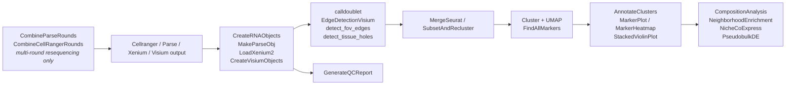

<h1 align="center">SingleCellTools</h1>

<p align="center">
  <strong>Opinionated R wrappers for end-to-end single-cell analysis</strong><br/>
  Load it, filter it, doublet-call it, merge it, integrate it, plot it &mdash; in fewer lines.
</p>

<p align="center">
  <a href="https://github.com/gevensen95/SingleCellTools/releases">
    
  </a>
  <a href="https://github.com/gevensen95/SingleCellTools/commits/main">
    
  </a>
  = 2.10" />
  
  
  <a href="vignettes/SingleCellTools_vignette.Rmd">
    
  </a>
</p>

---

## Overview

`SingleCellTools` is a collection of wrapper functions that reduce the boilerplate of common
single-cell workflows in R. Most of the package is built around **loading**, **filtering**, and
**integrating** single-cell data so you can spend more time on the analysis and less on the
plumbing.

Key things it does:

- Reads counts from **10x Genomics**, **Parse Biosciences**, **Visium**, **Xenium**, and **scATAC-seq** outputs into Seurat objects
- Calls **doublets** with DoubletFinder using either `LogNormalize` or `SCTransform`
- **Merges** and **integrates** lists of Seurat objects (Harmony / RPCA / CCA / JointPCA) with sensible defaults, and can subset + re-cluster a result for cell-type-specific re-analysis
- Detects **edge spots** in Visium capture areas, generic spatial **FOV edges**, and **internal tissue holes** &mdash; spots/cells that often have abnormal counts and should be filtered
- Two functions can be run **interactively** so you can pick filtering cutoffs by eye
- Generates a self-contained **HTML QC report** (per-sample summaries, suggested cutoffs, spatial QC maps)
- **Annotates clusters** with cell-type labels (marker scoring via UCell, or SingleR reference mapping) and assigns cells to **anatomical regions** from hand-drawn polygons
- Computes **cell-type composition** per sample/condition (with optional chi-square / Fisher tests) and plots it
- Spatial **neighborhood enrichment** between cell types, unsupervised **niche** assignment, and niche-resolved **differential gene co-expression**
- **Pseudobulk differential expression** (DESeq2) across donors/replicates
- Round-trips Seurat objects to/from **AnnData** (`.h5ad`) via `zellkonverter`
- A growing set of utilities for cell-cycle scoring, niche analysis, spatial polygons, and annotated dot plots

> For general-purpose pairwise gene co-expression analysis (not tied to spatial niches), see
> [katlande/scCoExpress](https://github.com/katlande/scCoExpress) &mdash; this package's
> `NicheCoExpress()` is adapted in spirit from it, but is specifically for testing niche-level,
> per-sample co-expression differences between two conditions.

---

## Documentation

- **[Vignette & function reference](vignettes/SingleCellTools_vignette.Rmd)** — covers every function group with worked examples, parameter tables, and tips for common pitfalls. Also installed as a real package vignette (`vignette("SingleCellTools_vignette", package = "SingleCellTools")` after installing with `build_vignettes = TRUE`).
- **[ifnb tutorial](SingleCellTools_vignette_ifnb.md)** — end-to-end walkthrough using the built-in `ifnb` PBMC dataset from `SeuratData`; no raw data download required.
- **[Spatial tutorial](SingleCellTools_vignette_spatial.md)** — Visium workflow (edge detection, integration, annotation, niche analysis) using the public `stxBrain` mouse brain dataset from `SeuratData`.
- **[scATAC-seq tutorial](SingleCellTools_vignette_atac.md)** — object creation, QC, LSI, cross-sample integration, gene activity scoring, motif enrichment, and differential accessibility. Supports mouse (`mm10`, default) or human (`hg38`) via `CreateATACObjects()`/`CreateATACObjectsFilter()`'s `genome` argument.
- **[Working with BPCells](SingleCellTools_vignette_bpcells.md)** — moving large single-cell/spatial datasets to on-disk matrices via `BPCells`: `ConvertToBPCells()`, the `on_disk` argument on `CreateRNAObjects()`/`CreateVisiumObjects()`/`LoadXenium2()`, and what still needs to stay in memory either way.

---

## Installation

```r
# install.packages("remotes")
remotes::install_github("gevensen95/SingleCellTools")
```

DoubletFinder is GitHub-only, so install that first if you don't have it:

```r
remotes::install_github("chris-mcginnis-ucsf/DoubletFinder")
```

Several Bioconductor packages are hard `Imports` (installed no matter which functions you
actually use) &mdash; `glmGamPoi`, `GO.db`, `AnnotationDbi`, `UCell`, `Signac`, `GenomicRanges`,
`IRanges`, `GenomeInfoDb`, `DESeq2`, `SummarizedExperiment`, `S4Vectors`, `edgeR`, `speckle`,
`OmnipathR`, `scmap`. Bioconductor needs to be configured for these; if install fails:

```r
if (!requireNamespace("BiocManager", quietly = TRUE)) install.packages("BiocManager")
BiocManager::install(c("glmGamPoi", "GO.db", "AnnotationDbi", "UCell", "Signac",
                       "GenomicRanges", "IRanges", "GenomeInfoDb", "DESeq2",
                       "SummarizedExperiment", "S4Vectors", "edgeR", "speckle",
                       "OmnipathR", "scmap"))
```

Some functions (see [Dependencies](#dependencies)) call optional packages listed under
`Suggests` &mdash; install these only if you need that specific function:

```r
remotes::install_github("dmcable/spacexr")        # RunRCTD()
remotes::install_github("prabhakarlab/Banksy")     # RunBanksyWrapper()
remotes::install_github("sqjin/CellChat")          # RunCellChat() -- CellChat is GitHub-only
BiocManager::install(c("SingleR", "SingleCellExperiment", "zellkonverter", "Nebulosa",
                       "EnsDb.Mmusculus.v79", "BSgenome.Mmusculus.UCSC.mm10"))
install.packages(c("sf", "harmony", "dabestr", "rmarkdown", "knitr"))
```

---

## A 60-second tour

```r
library(SingleCellTools)

# 1. Read several Cellranger outputs into a list of Seurat objects,
#    compute percent.mt, tag with treatment, and call doublets.
samples <- list.dirs("data/cellranger", recursive = FALSE)
objs    <- CreateRNAObjects(
  data_dirs    = samples,
  treatment    = c("Vehicle", "Vehicle", "DrugA", "DrugA"),
  mt_pattern   = "^mt-",
  run_doublet_finder = TRUE,        # uses calldoublet() under the hood
  filter_doublets    = TRUE
)

# 2. Merge + integrate (Harmony by default), cluster, UMAP, and save markers.
merged <- MergeSeurat(
  seurat_objects     = objs,
  integration        = "HarmonyIntegration",
  cluster_resolution = 0.3,
  markers            = TRUE
)

# 3. Annotate cells with a curated marker panel.
markers <- data.frame(
  Gene    = c("Sftpc", "Sftpb", "Ager", "Hopx",  "Trp63", "Krt5"),
  Details = c("AT2",   "AT2",   "AT1",  "AT1",   "Basal", "Basal")
)
MarkerPlot(merged, markers)
```

---

## Function reference

<details open>
<summary><strong>Object creation / loading</strong></summary>

| Function | What it does |
|---|---|
| `CreateRNAObjects()` | Read 10x outputs (matrix folder or `.h5`) into a list of Seurat objects, compute `percent.mt`, optionally tag treatments and call doublets. `on_disk = TRUE` moves the returned counts layer(s) to an on-disk `BPCells` matrix as a final step (see `ConvertToBPCells()`). |
| `CreateRNAObjectsFilter()` | Same as above but with **interactive** QC cutoff selection. |
| `CreateAndIntegrateRNA()` | One-shot pipeline: read &rarr; QC &rarr; merge &rarr; integrate &rarr; cluster &rarr; UMAP. |
| `MakeParseObj()` | Build Seurat objects from Parse Biosciences pipeline output (`DGE_filtered/`). |
| `CombineParseRounds()` | Combine two Parse Biosciences resequencing rounds of the same libraries by barcode &mdash; unions genes and cells, sums counts for barcodes present in both rounds, zero-fills cells/genes seen in only one, and writes a combined `DGE_filtered/`-style output per sample ready for `MakeParseObj()`. |
| `CombineCellRangerRounds()` | Same idea for CellRanger output: combines two resequencing rounds' barcodes/features/matrix triplets by barcode (GEM-well suffix like `-1` stripped by default so the same physical cell matches across rounds), writing a combined `filtered_feature_bc_matrix/`-style output per sample ready for `CreateRNAObjects()`. Gene key is matrix rowname (symbol by default, not Ensembl ID) since it reuses the package's existing 10x reader. |
| `CreateVisiumObjects()` | Load multiple Visium samples into a list. `image_backend = "deferred"` attaches the small lowres image to every sample instead of the ~100MB hires PNG, for multi-sample lists. Also handles Visium HD samples (auto-detected via a `binned_outputs/` subdirectory; `hd_bin_size` picks 002um/008um/016um, default 008um) -- requires `binned_outputs.tar.gz`/`spatial.tar.gz` already extracted. `on_disk = TRUE` moves the counts layer to an on-disk `BPCells` matrix as a final step -- the highest-value spot for it, given how large a 002um HD sample's counts matrix is. |
| `GetHiresVisiumImage()` | Decode the full-resolution image for a sample built with `image_backend = "deferred"`, on demand. |
| `SpatialObjectInfo()` | Audit image/FOV class, resolution, cell count, and memory footprint across a Visium *or* Xenium/CosMx/MERFISH sample or list -- see where spatial memory is going, whichever platform built the object. |
| `DropSpatialImage()` | Retroactively free image/molecule memory on already-built spatial object(s): `mode = "remove"` drops `@images` entirely (any platform), `mode = "downgrade"` swaps pixel-backed (Visium) images to lowres (like `image_backend = "deferred"` after the fact) -- coordinate-only (FOV) images have no lowres equivalent and are left in place with a message. |
| `RenameSpatialImages()` | Safely rename `obj@images` -- either auto-derived per image from a metadata column (by each image's own cells, not position, so a naive `names(obj@images) <- ...` can't silently swap two samples) or an explicit positional/named `new_names` mapping. Errors on ambiguous or colliding names instead of producing a broken object. |
| `ConvertToBPCells()` | Move a Seurat object's (or list's) assay layer to an on-disk `BPCells` matrix, in place of the in-memory one -- works retroactively on any Seurat object regardless of how it was built, using `BPCells`' `Assay5`-compatible on-disk matrix backend so native Seurat functions keep working unmodified. `BPCells` is Suggests-only (`remotes::install_github("bnprks/BPCells/r")`). |
| `LoadXenium2()` | Streamlined Xenium loader. `microns_lazy = TRUE` reads `transcripts.parquet` via `arrow`'s query engine instead of loading the full table, for whole-slide runs. `on_disk = TRUE` moves the counts layer to an on-disk `BPCells` matrix as a final step. |
| `QueryXeniumMolecules()` | Windowed / gene-subset transcript query against an object loaded with `LoadXenium2(..., microns_lazy = TRUE)`, without re-reading `transcripts.parquet`. |
| `CreateATACObjects()` / `CreateATACObjectsFilter()` | scATAC-seq object construction (latter with interactive cutoff selection). |

</details>

<details open>
<summary><strong>QC, doublets, and gene-ID sanity checks</strong></summary>

| Function | What it does |
|---|---|
| `calldoublet()` | DoubletFinder wrapper. Pick `LogNormalize` or `SCT`, regress covariates, returns object tagged with `doublet_finder` (plus `doublet_pANN`, the raw score). Strips intermediate layers/reductions on return. `doublet_rate` (default `0.075`) sets the assumed doublet **formation** rate driving `nExp` &mdash; scale it to your recovered cell count (10X is roughly 0.8% per 1,000 cells). `pk_sweep_max_cells` (default `4000`) estimates pK from a random subsample instead of every cell, and `sweep_cores` parallelizes DoubletFinder's own 6-value pN sweep internally &mdash; both aimed at the sweep's per-sample cost, normally the dominant cost of doublet calling. |
| `PlotQCMetrics()` | Multi-panel QC figure from a Seurat object (or list) &mdash; auto-detects `nFeature`/`nCount`/`percent.mt`/doublet-calling columns and grouping column (default `orig.ident`), or pass `qc_cols` to specify exactly which columns to plot. |
| `EdgeDetectionVisium()` | Flags Visium spots at the edge of the capture area, around tissue boundaries, and at tears &mdash; the spots with weird counts that you almost certainly want to drop. |
| `detect_fov_edges()` | Flags cells near the outer boundary of any spatial FOV (Visium, Xenium, MERFISH, ...) using an angular-gap + local-density test, with iterative ring labeling. |
| `detect_tissue_holes()` | Flags cells bordering internal gaps/holes within a spatial FOV via a 2D occupancy grid and flood fill &mdash; complements `detect_fov_edges()`. |
| `GenerateQCReport()` | Renders a self-contained HTML QC report: per-sample overview, violin/density plots, QC scatters, top expressed genes, suggested filtering cutoffs, cell-cycle/doublet breakdowns, sample-correlation heatmap, and (for spatial input) per-FOV QC maps including edge and tissue-hole sections. |
| `ApplyQCFilters()` | Applies the recommended per-sample, per-metric cutoffs from a `GenerateQCReport()` sidecar CSV &mdash; keeps cells only where *every* selected metric falls within its suggested range, with optional per-sample/per-metric overrides and doublet filtering. |
| `QCComparePlots()` | Violin overlays of QC metrics from paired pre-/post-filter Seurat objects (or lists) &mdash; one violin per (sample, filter-state) with an `n_before -> n_after` annotation, to sanity-check what `ApplyQCFilters()` actually did. |
| `DetectGenes()` | Bulk detection / quality flags on a feature set. |
| `detect_gene_id_type()` | Inspects rownames to tell you if your features are HGNC/MGI symbols, Ensembl IDs, RefSeq, or Entrez. |
| `check_gene_ids_across_objects()` | Same check across a list &mdash; catches the silent "one object is symbols, another is Ensembl" trap before a merge. |
| `check_duplicate_genes()` | Reports duplicated feature names per object/assay &mdash; catches the most common cause of the `"duplicate 'row.names' are not allowed"` error during `merge()`. |
| `CellSuiteSummary()` | One-command project summary: cell/gene counts, per-cluster counts, QC-metric medians/IQRs, top markers per cluster, reductions present, and (optionally) per-sample counts &mdash; everything you'd want at the top of a README or handoff, with a pretty `print()` method. |

</details>

<details open>
<summary><strong>Merging and integration</strong></summary>

| Function | What it does |
|---|---|
| `MergeSeurat()` | Merge a list, normalize (SCT or LogNormalize), PCA, integrate (`HarmonyIntegration`/`RPCA`/`CCA`/`JointPCA`), cluster, UMAP, and (optionally) run `FindAllMarkers`. Supports spatial assays (`Visium`, `Xenium`); pass `banksy = TRUE` (with `spatial = "Visium"`/`"Xenium"`) to run BANKSY spatial-aware clustering instead of plain PCA. `HarmonyIntegration` calls `harmony::RunHarmony()` directly rather than `Seurat::IntegrateLayers()`, so it works with current `harmony` releases. |
| `RunBanksyWrapper()` | Thin wrapper around `SeuratWrappers::RunBanksy()` that resolves spatial x/y coordinates automatically (via `get_all_coords()` for imaging-based FOVs, or Seurat's native spatial framework for Visium) and optionally runs `RunPCA()` on the resulting BANKSY assay. Used internally by `MergeSeurat(banksy = TRUE)`, but can be called directly. |
| `BatchEffectQC()` | Quantifies batch mixing / integration quality on a reduction (silhouette width by batch and by cell type, kNN batch-mixing ratio, kNN cell-type purity) &mdash; run before and after integration (e.g. `MergeSeurat()`'s Harmony/RPCA/CCA/JointPCA) to check whether it actually helped. |
| `subset_opt()` | Subset variant written specifically for CosMx/Xenium `FOV` objects (uses their `centroids`/`molecules` sub-slots) &mdash; keeps FOVs in sync with the cell list and optionally cleans the molecules slot afterward. Not for Visium (`VisiumV1`/`VisiumV2`) images; use `SubsetSpatial()` for those. |
| `SubsetSpatial()` | General-purpose spatial-safe subset: works on *any* image type (Visium pixel-backed or FOV coordinate-only). `base::subset()` on a Seurat object can leave `@images` internally inconsistent (upstream Seurat bug, [satijalab/seurat#8848](https://github.com/satijalab/seurat/issues/8848)) &mdash; the error ("All cells in images must be present in the Seurat object") doesn't surface at subset time, only later, whenever something else (`RunPCA()`, `PrepSCTFindMarkers()`, `ScaleData()`, ...) happens to call `validObject()`. `SubsetSpatial()` explicitly re-subsets every image against the object's post-subset cells afterward, so it can't happen &mdash; unlike `DropSpatialImage()`, images stay attached and usable for plotting. |
| `SubsetAndRecluster()` | Subset cells by identity, metadata column/value, or an explicit cell list, drop empty cells/genes left behind, then re-run PCA &rarr; integrate (optional) &rarr; UMAP &rarr; clustering on the subset. Useful for cell-type-specific re-analysis. |
| `combine_metadata()` | Stack `@meta.data` from a list of Seurat objects into one long tibble, tagging each row with its source sample and original cell barcode. |
| `CleanMolSlot()` | For spatial objects, drop molecules not assigned to any FOV from the molecules slot, shrinking the object. |
| `strip_workflow_artifacts()` | Remove normalized/scaled layers, variable-feature sets, and dimensional reductions (`pca`, `umap`, `harmony`, ...), leaving just counts + metadata &mdash; handy before saving or sharing an object. |
| `SaveWithProvenance()` | Writes a Seurat object as `.rds` plus a `<name>_provenance.json` sidecar recording package versions, assay/layer/reduction/metadata state, cell/gene counts, and (optionally) the calling script's git SHA &mdash; so a saved object's analysis state is inspectable without loading it. |

</details>

<details open>
<summary><strong>Annotation and scoring</strong></summary>

| Function | What it does |
|---|---|
| `AddGenePositivity()` | For a vector of genes, adds a logical `<gene>_pos` metadata column per cell. Accepts a single object or a list. |
| `GenePositivityAnalysis()` | Per-gene, per-sample positivity rates (optionally stratified by cell type/cluster/niche), with an optional chi-square or Fisher's exact test comparing rates across conditions &mdash; the `AddGenePositivity()` counterpart to `CompositionAnalysis()`. |
| `GenePositivityEstimationPlot()` | Bootstrap effect-size ("estimation") plots (via `dabestr`) for a `GenePositivityAnalysis()` result &mdash; per-gene positivity-rate shift between two conditions with a 95% CI, as a complement to its p-value, in the same spirit as `CompositionEstimationPlot()`. |
| `assign_cell_cycle_phase()` | Cell-cycle phase assignment via UCell &mdash; like `CellCycleScoring` but with `AddModuleScore_UCell` under the hood. |
| `AnnotateWithReference()` | Reference-based cell-type annotation via one of three backends: CellTypist (Python, no reference needed &mdash; pre-trained model zoo), scANVI (Python, semi-supervised VAE from a labeled reference), or scmap (R-native, Bioconductor). Writes a predicted-label column (and, where available, a confidence-score column) to `@meta.data`. |
| `AnnotateClusters()` | Assign per-cluster cell-type labels: either average UCell marker-set scores per cluster ("marker" mode) or run SingleR against a reference and take a per-cluster majority vote ("singler" mode), with optional score/margin thresholds for an "Unknown" label. |
| `CompositionAnalysis()` | Cell counts and within-sample proportions per group (cluster/cell type) and sample, with an optional chi-square or Fisher's exact test comparing distributions across conditions. |
| `CellComposition()` | Per-sample proportions of each cluster / cell type as a tidy data frame, with `"stack"`/`"box"`/`"line"` ggplot styles &mdash; a lighter-weight sibling to `CompositionAnalysis()` without the significance test. |
| `CompositionalTest()` | Standalone statistical engine behind `CompositionAnalysis()`'s test option &mdash; chi-square/Fisher's exact for categorical composition, or `propeller`-based (t-test for 2 groups, ANOVA for >2) for continuous per-sample proportions, with optional sample-level weights. |
| `CompositionEstimationPlot()` | Bootstrap effect-size ("estimation") plots (via `dabestr`) for a `CompositionAnalysis()` result &mdash; per-cell-type proportion shift between two conditions with a 95% CI, alongside the raw per-sample values, as a complement to `CompositionAnalysis()`'s p-value. |
| `get_all_children()` | Recursively walk a GO term to collect every descendant. |
| `RunCellChat()` | Wraps the full `CellChat` pipeline (`createCellChat` through `aggregateNet`) into one call for a single Seurat subset (e.g. one condition/sample) &mdash; pairs naturally with `RunLIANA()` for a second, complementary ligand-receptor method. |
| `call_mixture_states()` | Fits a Gaussian mixture model (via `mclust`) on one or more numeric metadata columns and returns a BIC-selected, ranked state call per row plus posterior-probability confidence/severity scores &mdash; a principled alternative to a hand-picked quantile cutoff on a module/composite score. |
| `call_stress_states()` | Thin convenience wrapper around `call_mixture_states()` reproducing a fixed legacy column-naming convention (`annotation_first_pass` cell-type column, `stress_composite` score column by default). |
| `PseudotimeWrapper()` | Wraps `slingshot` to fit lineage curves through a reduced-dimensional embedding (cluster labels as anchors) and writes one pseudotime metadata column per detected lineage, with the full `SlingshotDataSet` stashed in `@misc$slingshot`. |

</details>

<details open>
<summary><strong>Spatial / niche</strong></summary>

| Function | What it does |
|---|---|
| `BuildMultipleNicheAssays()` | Construct a spatial neighborhood ("niche") assay across a list of objects, then cluster with `ClusterR::MiniBatchKmeans`. |
| `SetImageBoundary()` | Set / standardize image boundaries on spatial objects. |
| `combine_fovs()` | Merge multiple FOVs from the same sample. |
| `get_all_coords()` | Pull tissue coordinates across images. |
| `get_cells_in_polygon()` | Point-in-polygon test using `sf` &mdash; which cells fall inside a hand-drawn region? |
| `parse_polygons()` | Parse polygon definitions for use with the above. |
| `get_polygon_coords()` | Per-vertex cell *segmentation*-boundary coordinates for a FOV (Xenium/CosMx/MERFISH &mdash; any image with a `"segmentation"` boundary set, not just centroids), optionally joined with metadata; feeds `PlotPolygons()`. |
| `RunRCTD()` | Wraps `spacexr::create.RCTD` + `run.RCTD` to estimate per-spot cell-type proportions on Visium data from a single-cell reference. Accepts a single object or a named list (reference built once, reused across samples). Writes per-cell-type `rctd_<celltype>` proportion columns plus `rctd_dominant`, `rctd_max_weight`, and (doublet/multi mode) `rctd_spot_class`. |
| `SpatialDimPlotFixed()` | Drop-in `ggplot2` replacement for `Seurat::SpatialDimPlot()`: tissue image + spots colored by a discrete grouping variable, via a real `geom_point(size = ...)` layer instead of Seurat's custom `GeomSpatial` geom, whose `pt.size.factor` has real, documented regressions in recent Seurat releases where it silently has no effect (satijalab/seurat#9491, #6179). Supports multi-sample panel grids with a collected legend via `patchwork`. |
| `SpatialFeaturePlotFixed()` | Same fix, for continuous features (genes, module scores, any `Seurat::FetchData()`-able column) in place of `Seurat::SpatialFeaturePlot()`. Same-feature panels across samples share one color scale/legend; different features get their own. |
| `SpatialCompositionPlot()` | Pie/donut glyph per spot showing its full RCTD cell-type mixture, instead of collapsing each spot to one dominant color like `SpatialDimPlot()` would. |
| `SummarizeRCTDByCluster()` | Cluster-level companion to `RunRCTD()`: averages the *soft* `rctd_<celltype>` proportions within each cluster (instead of tabulating the already-collapsed `rctd_dominant` label, which loses minority signal one level earlier) and assigns each cluster a best-guess cell type using the same margin-based logic `AnnotateClusters()` uses internally. Returns `list(composition, labels)` &mdash; nothing is written back to the object. |
| `RCTDCompositionHeatmap()` | Heatmap of `SummarizeRCTDByCluster()`'s cluster x cell-type composition matrix. Z-scores each cell type across clusters by default, so a consistently-dominant type (e.g. hepatocytes in liver &mdash; real biology, not a bug) doesn't bury the actually differentiating minority cell types under its own raw magnitude. Accepts a Seurat object, the `SummarizeRCTDByCluster()` result list, or a raw composition matrix. |
| `AnnotateRegions()` | Label every cell with the name of the polygon it falls inside (or `"unassigned"`), given a named list of `x`/`y` polygon data frames &mdash; pairs with `get_cells_in_polygon()` / `parse_polygons()`. |
| `NeighborhoodEnrichment()` | Permutation-based cell-type neighborhood enrichment (z-scores, empirical p-values, BH q-values) within and pooled across FOVs; optionally clusters each cell's neighborhood composition into spatial "niches" and returns an updated copy of the object (with the niche column added) as `$obj`. |
| `SpatialConcordance()` | Per-sample QC check for a categorical spatial label (zonation call, spatial domain, niche assignment): permutation-tested same-label k-nearest-neighbor concordance, one row per image. Answers "is this label spatially coherent at all?" &mdash; a coarser, per-sample question than `NeighborhoodEnrichment()`'s pooled focal x neighbor enrichment matrix. |
| `NicheCoExpress()` | Per-sample, per-niche gene-pair co-expression (Manders Overlap Coefficient vs. an abundance-matched background), with differential testing between two conditions and optional cell-type-composition controls. |
| `plotNicheCoExpress()` | Heatmap of differential co-expression (`delta`, with significance stars) or per-sample score plots for `NicheCoExpress()` results. |
| `NicheCoExpressEstimationPlot()` | Bootstrap effect-size ("estimation") plots (via `dabestr`) for one or more (niche, gene-pair) combinations from a `NicheCoExpress()` result &mdash; a complement to its Wilcoxon/t-test p-value, in the same spirit as `CompositionEstimationPlot()`. |

</details>

<details open>
<summary><strong>Differential expression</strong></summary>

| Function | What it does |
|---|---|
| `PseudobulkDE()` | Aggregates single-cell counts per (sample, group) and runs DESeq2 to test a contrast between two conditions &mdash; the statistically correct alternative to per-cell Wilcoxon DE when there are multiple cells per donor. Returns DE results plus size-factor-normalized pseudobulk counts. |
| `CompareMarkers()` | Merges two DE result data frames (e.g. two `PseudobulkDE()`/`FindMarkers()` contrasts), classifies genes as shared-up/shared-down/opposite-sign/only-in-one, and runs a Fisher's exact test on the overlap &mdash; "which markers are shared, which are unique, do they agree in direction." |
| `PlotVolcano()` | Volcano plot for any DE result table, with automatic column-name detection (`FindMarkers`- or `PseudobulkDE`-style), configurable significance/effect thresholds, and top-N gene labeling. |

</details>

<details open>
<summary><strong>Data interop (AnnData)</strong></summary>

| Function | What it does |
|---|---|
| `FromAnnData()` | Read an `.h5ad` file into a Seurat object via `zellkonverter` (`SingleCellExperiment` &rarr; `Seurat`). |
| `ToAnnData()` | Write a Seurat object out to an `.h5ad` file via `zellkonverter` (`Seurat` &rarr; `SingleCellExperiment`). |

</details>

<details open>
<summary><strong>Plotting</strong></summary>

| Function | What it does |
|---|---|
| `MarkerPlot()` | Annotated dot plot. Genes are grouped by a `Details` column, identities can be optionally clustered by correlation, and absent or all-zero-expression genes are dropped automatically so you never see a blank row. Text size and a suggested figure size auto-scale with the gene count (large panels get smaller text and a taller suggested height) so a 100+ gene panel doesn't collapse into overlapping labels; pass `save_path` to save directly at that size. |
| `MarkerHeatmap()` | Heatmap of the top N markers per cluster (from `FindAllMarkers` or computed on the fly), z-scored across clusters with optional row/column clustering. Pass `genes = c(...)` instead of a markers table/`n` to plot an explicit, curated gene list rather than a data-driven top-N selection. `pseudobulk = TRUE` sums raw counts per cluster and normalizes once instead of averaging per-cell values &mdash; more robust on sparse data (e.g. Visium) where per-cell/per-spot noise is a real concern. |
| `MarkerPctPlot()` | Sibling to `MarkerPlot()` that isolates percent-positive as a heatmap or sized dot plot (instead of entangling it with average-expression color), organized by the same gene-annotation grouping, with optional identity clustering. |
| `PlotFeatureDensity()` | Nebulosa-style 2D kernel-density plot of expression (or module scores) on a reduction &mdash; much easier to read than `Seurat::FeaturePlot()`'s grey-to-blue points in dense regions. Optional joint co-expression density panel. |
| `StackedViolinPlot()` | Compact, scanpy-style stacked violin plot &mdash; one row per gene, one violin per group, optionally scaled per gene. |
| `CompositionBarplot()` | Stacked or grouped bar plot of cell-type composition (proportions or counts), optionally faceted by condition; pairs with `CompositionAnalysis()`. |
| `PlotGenePositivity()` | Visualizes the `AddGenePositivity()` logical columns as a dodged bar chart, group x gene heatmap, or stacked co-expression-combination chart; accepts a single object, a list, or one object with a `sample_col` for per-sample facets. |
| `PlotPolygons()` | Flexible per-cell segmentation-polygon plot (from `get_polygon_coords()`), colored by any continuous or discrete column &mdash; a more flexible alternative to `Seurat::ImageFeaturePlot()`/`ImageDimPlot()`. Plain `ggplot`, fully chainable. |
| `stack_polygons()` | Prepares a `PlotPolygons()` plot to be layered into one composite figure with other polygon plots on a shared coordinate range, each keeping its own color scale (as a transparent `patchwork` inset). |
| `collect_legend()` | Pulls a plot's legend out as a standalone grob &mdash; recovers the legends `stack_polygons()` strips, so they can be laid out separately alongside the combined overlay. |
| `Ol_Reliable()` | Shared `ggplot2` theme (clean panel borders, subtle gridlines, bold black-and-white facet strips) applied by default across this package's plotting functions. Add it to your own `ggplot()` calls (`+ Ol_Reliable()`) to match. |

</details>

---

## Typical workflow


```mermaid
flowchart LR
    Z[CombineParseRounds<br/>CombineCellRangerRounds<br/><i>multi-round resequencing only</i>] --> A
    A[Cellranger / Parse / Xenium / Visium output] --> B[CreateRNAObjects<br/>MakeParseObj<br/>LoadXenium2<br/>CreateVisiumObjects]
    B --> C[calldoublet<br/>EdgeDetectionVisium<br/>detect_fov_edges<br/>detect_tissue_holes]
    B --> Q[GenerateQCReport]
    C --> D[MergeSeurat / SubsetAndRecluster]
    D --> E[Cluster + UMAP<br/>FindAllMarkers]
    E --> F[AnnotateClusters<br/>MarkerPlot / MarkerHeatmap<br/>StackedViolinPlot]
    F --> G[CompositionAnalysis<br/>NeighborhoodEnrichment<br/>NicheCoExpress<br/>PseudobulkDE]
```

---

## Dependencies

| Category | Packages |
|---|---|
| **Seurat ecosystem** | `Seurat`, `SeuratObject`, `Signac` |
| **DoubletFinder** | `DoubletFinder` (GitHub: `chris-mcginnis-ucsf/DoubletFinder`) |
| **Bioconductor (core)** | `GenomicRanges`, `IRanges`, `GenomeInfoDb`, `glmGamPoi`, `GO.db`, `AnnotationDbi`, `UCell` |
| **Differential expression & stats** | `DESeq2`, `SummarizedExperiment`, `S4Vectors`, `edgeR` (`PseudobulkDE`); `speckle`, `limma` (`CompositionalTest`) |
| **Cell-cell communication** | `liana`, `OmnipathR` (`RunLIANA()`, loaded on demand rather than at package startup) |
| **Trajectory / state calling** | `slingshot` (`PseudotimeWrapper()`); `mclust`, `ks`, `MASS`, `cluster` (`call_mixture_states()`) |
| **Tidyverse** | `dplyr`, `tibble`, `tidyr`, `magrittr`, `readr`, `stringr`, `purrr`, `rlang`, `ggplot2` |
| **Numerical / spatial** | `Matrix`, `RANN`, `ClusterR`, `irlba`, `RSpectra` |
| **Plotting** | `RColorBrewer`, `patchwork` |
| **Optional (Suggests)** | `sf` (`get_cells_in_polygon`, `AnnotateRegions`); `SingleR` + `SingleCellExperiment` (`AnnotateClusters(method = "singler")`); `zellkonverter` + `anndata` + `basilisk` (`FromAnnData` / `ToAnnData`); `harmony` (`MergeSeurat()`'s Harmony integration path); `rmarkdown` + `knitr` (`GenerateQCReport`); `spacexr` (GitHub: `dmcable/spacexr`) for `RunRCTD()` deconvolution; `CellChat` (GitHub: `sqjin/CellChat`) for `RunCellChat()`; `Banksy` (GitHub: `prabhakarlab/Banksy`) + `SeuratWrappers` (GitHub: `satijalab/seurat-wrappers`) for `RunBanksyWrapper()` / `MergeSeurat(banksy = TRUE)`; `dabestr` for the estimation-plot functions (`CompositionEstimationPlot()`, `NicheCoExpressEstimationPlot()`, `GenePositivityEstimationPlot()`); `Nebulosa` (`PlotFeatureDensity()`); `arrow` + `data.table` + `R.utils` (`LoadXenium2(microns_lazy = TRUE)`, `MakeParseObj()`); `png` + `scatterpie` (spatial composition plotting); `org.Mm.eg.db` / `org.Hs.eg.db` + `EnsDb.Mmusculus.v79` + `BSgenome.Mmusculus.UCSC.mm10` or `EnsDb.Hsapiens.v86` + `BSgenome.Hsapiens.UCSC.hg38` (`CreateATACObjects()` / `CreateATACObjectsFilter()`, whichever `genome` you request); `BPCells` (GitHub: `bnprks/BPCells/r`) for `ConvertToBPCells()` and `on_disk = TRUE` on `CreateRNAObjects()`/`CreateVisiumObjects()`/`LoadXenium2()` |

`spacexr`, `Banksy`, `SeuratWrappers`, and `BPCells` are GitHub-only and declared under
`Remotes:` in [`DESCRIPTION`](DESCRIPTION), so `remotes::install_github("gevensen95/SingleCellTools")`
resolves them automatically -- no separate `install_github()` call needed for those four.
`DoubletFinder` is the one GitHub-only dependency *not* listed under `Remotes:`, which is why it
needs the manual install step above. A full list with version pins lives in `DESCRIPTION`.

---

## Tips

- Read each function's `?docs` before calling &mdash; defaults are sensible, but most functions
  have several knobs (assay, regression variables, doublet normalization, etc.) that are worth
  knowing about.
- The two `*Filter` variants of the object-creation functions are interactive and prompt for
  cutoffs at the console.
- For Visium, run `EdgeDetectionVisium()` before merging &mdash; edge / tear spots are usually
  the worst-quality cells in the dataset. For other spatial technologies, `detect_fov_edges()`
  and `detect_tissue_holes()` cover the analogous outer-edge and internal-gap cases.
- `GenerateQCReport()` is a good first stop on a new dataset &mdash; it surfaces suggested
  filtering cutoffs and (for spatial data) per-FOV QC maps before you commit to thresholds.
- `AnnotateClusters()` leaves the "Unknown" checks off by default (every cluster gets its
  top-scoring label); pass `min_score`/`min_margin` (or `NULL` for mode-specific defaults) to
  flag low-confidence clusters instead.

---

## Author

**K. Garrett Evensen, PhD**
Bioinformatics Analyst II &mdash; The Salk Institute for Biological Studies

- GitHub: [@gevensen95](https://github.com/gevensen95)
- ORCID: [0000-0002-6720-2526](https://orcid.org/0000-0002-6720-2526)

## Issues and contributions

Bug reports and feature requests are welcome on the
[issue tracker](https://github.com/gevensen95/SingleCellTools/issues). For pull requests, please
re-run `devtools::document()` so the `NAMESPACE` and `man/` files stay in sync.

## Acknowledgments

Built on top of the excellent work of the
[Seurat](https://satijalab.org/seurat/),
[Signac](https://stuartlab.org/signac/),
[DoubletFinder](https://github.com/chris-mcginnis-ucsf/DoubletFinder), and
[UCell](https://github.com/carmonalab/UCell) teams.
